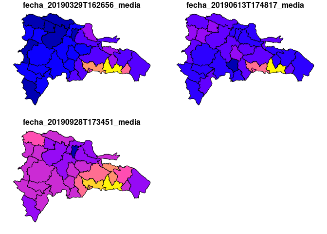
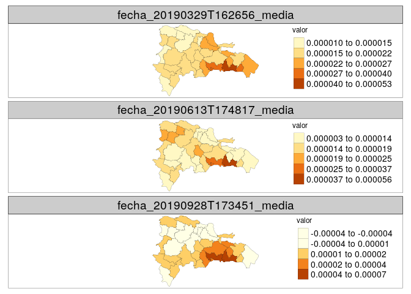

Análisis de datos atmosféricos
================

Instalar paquete S5Processor
----------------------------

``` r
#devtools::install_github("MBalthasar/S5Processor")
```

Cargar paquetes
---------------

``` r
library(S5Processor)
library(raster)
```

    ## Loading required package: sp

``` r
library(rgdal)
```

    ## rgdal: version: 1.4-8, (SVN revision 845)
    ##  Geospatial Data Abstraction Library extensions to R successfully loaded
    ##  Loaded GDAL runtime: GDAL 2.2.3, released 2017/11/20
    ##  Path to GDAL shared files: /usr/share/gdal/2.2
    ##  GDAL binary built with GEOS: TRUE 
    ##  Loaded PROJ.4 runtime: Rel. 7.0.0, March 1st, 2020, [PJ_VERSION: 700]
    ##  Path to PROJ.4 shared files: (autodetected)
    ##  Linking to sp version: 1.3-1

``` r
library(sf)
```

    ## Linking to GEOS 3.6.2, GDAL 2.2.3, PROJ 7.0.0

``` r
library(readr)
library(tidyverse)
```

    ## ── Attaching packages ───────────────────────────────────────────────────────────────────────────── tidyverse 1.2.1 ──

    ## ✔ ggplot2 3.2.0     ✔ purrr   0.3.3
    ## ✔ tibble  2.1.3     ✔ dplyr   0.8.1
    ## ✔ tidyr   0.8.3     ✔ stringr 1.4.0
    ## ✔ ggplot2 3.2.0     ✔ forcats 0.4.0

    ## ── Conflicts ──────────────────────────────────────────────────────────────────────────────── tidyverse_conflicts() ──
    ## ✖ tidyr::extract() masks raster::extract()
    ## ✖ dplyr::filter()  masks stats::filter()
    ## ✖ dplyr::lag()     masks stats::lag()
    ## ✖ dplyr::select()  masks raster::select()

``` r
library(tmap)
basegeofispath <- 'https://raw.githubusercontent.com/geofis/'
devtools::source_url(paste0(
  basegeofispath,
  'geomorpho90m-tools/master/estadistica_zonal_objetos.R'))
```

    ## SHA-1 hash of file is 28e4951c147087108b5b17fb6756cc983196528b

Cargar datos
------------

``` r
# f <- 'S5P_OFFL_L2__NO2____20190401T171141_20190401T185312_07595_01_010300_20190407T185548.nc'
# f <- 'S5P_OFFL_L2__NO2____20200401T174952_20200401T193122_12788_01_010302_20200403T102954.nc'
f <- 'S5P_NRTI_L2__NO2____20191209T173610_20191209T174110_11170_01_010302_20191209T182308.nc'
nc <- ncdf4::nc_open(f)
vars <- attributes(nc$var)$names
p <- 6
p
ncr <- S5P_process(input = f, product = p)
ncr
```

Exportar
--------

``` r
writeRaster(ncr, paste0(gsub('.nc', '', f), '_', gsub('/','_', vars[p]), '.tif'), overwrite=T)
```

Instalar sentinelsat (API de Sentinel)
--------------------------------------

``` bash
git clone https://github.com/sentinelsat/sentinelsat.git
sudo apt install python-pip
pip install sentinelsat
sudo find / -type f -iname '*sentinelsat*'
/home/mirel/.local/bin/sentinelsat -u s5pguest -p s5pguest -g /home/mirel/Documents/analisis-atmosfericos-mirel/descargas/rd.geojson --sentinel 5 -s 20181018 -e 20191018 --url "https://s5phub.copernicus.eu/dhus" --producttype L2__NO2___
#Footprins y metadatos:
/home/mirel/.local/bin/sentinelsat -u s5pguest -p s5pguest -d -g /home/mirel/Documents/analisis-atmosfericos-mirel/descargas/rd.geojson --sentinel 5 -s 20181018 -e 20181019 --url "https://s5phub.copernicus.eu/dhus" --producttype L2__NO2___ --footprints
#Para descargar, agrega flag -d, ejemplo:
/home/mirel/.local/bin/sentinelsat -u s5pguest -p s5pguest -d -g /home/mirel/Documents/analisis-atmosfericos-mirel/descargas/rd.geojson --sentinel 5 -s 20181018 -e 20181019 --url "https://s5phub.copernicus.eu/dhus" --producttype L2__NO2___
```

Revisar y descargar pendientes (ejecutar al finalizar la descarga por fecha)
----------------------------------------------------------------------------

``` r
fp <- st_read('descargas/footprints-20181018-20191018.geojson')
nombrestodos <- gsub('\\.nc', '', fp$filename)
descargados_df <- read_delim('lista-descargas-a-20200210.txt', delim = ' ', col_names = F)
#El archivo "lista-descargas-a-20200210.txt" se genera al ejecutar, en la terminal,
#ls -al > lista-descargas-a-20200210.txt
#dentro de la carpeta donde se encuentren todas las imágenes
descargados <- gsub('\\.zip$', '', grep('^S5P.*', descargados_df$X9, value = T))
match(nombrestodos, descargados)
#N pendientes
length(which(is.na(match(nombrestodos, descargados))))
#Indice pendientes
uuidpendientes <- fp %>%
  slice(which(is.na(match(nombrestodos, descargados)))) %>%
  pull(uuid) %>% as.character()
sapply(
  uuidpendientes,
  function(x) {
    system(
      paste0(
        '/home/mirel/.local/bin/sentinelsat ',
        '--uuid ', x,
        ' -u s5pguest -p s5pguest -d ',
        '-g /home/mirel/Documents/analisis-atmosfericos-mirel/descargas/rd.geojson ',
        '--sentinel 5 ',
        '--url "https://s5phub.copernicus.eu/dhus"'
      )
    )
  }
)
```

Renombrar ZIP y generar TIFF por lotes
--------------------------------------

``` r
rutalotes <- 'descargas/asis'
archivosraw <- list.files(rutalotes, pattern = '*.zip', full.names = T)
subzipnc <- gsub('.zip$', '.nc', archivosraw)
file.rename(archivosraw, subzipnc)
archivosnc <- list.files(rutalotes, pattern = '*.nc', full.names = T)
sapply(
  archivosnc,
  function(x) {
    nc <- ncdf4::nc_open(x)
    vars <- attributes(nc$var)$names
    p <- grep('nitrogendioxide_tropospheric_column$', vars)
    p
    ncr <- S5P_process(input = x, product = 6)
    writeRaster(ncr, paste0(gsub('.nc', '', x), '_', gsub('/','_', vars[p]), '.tif'), overwrite=T)
  }
)
```

Recortar rásters
----------------

``` r
tifs <- list.files('descargas/asis/', pattern = '*.tif', full.names = T)
prov <- st_read('descargas/provincias.geojson')
```

    ## Reading layer `provincias' from data source `/home/jose/Documentos/git/analisis-atmosfericos-mirel/descargas/provincias.geojson' using driver `GeoJSON'
    ## Simple feature collection with 34 features and 6 fields
    ## geometry type:  POLYGON
    ## dimension:      XY
    ## bbox:           xmin: -72.01147 ymin: 17.59665 xmax: -68.32354 ymax: 19.93211
    ## CRS:            4326

``` r
provbuffer <- st_buffer(prov, res(raster(tifs[1]))[1]) %>% st_union
st_write(provbuffer, 'descargas/provincias_buffer.geojson')
sapply(
  tifs,
  function(x){
    system(
      paste('gdalwarp -overwrite -cutline descargas/provincias_buffer.geojson -crop_to_cutline',
             x, gsub('\\.tif', '_crop.tif', x))
    )
  }
)
```

Estadística zonal por lotes, mapas
----------------------------------

``` r
tifscropped <- list.files('descargas/asis/', pattern = '*_crop.tif', full.names = T)
estzonal <- sapply(
  tifscropped,
  function(x){
    fecha <- gsub('_.*', '', gsub('^.*NO2____', '', x))
    r <- raster(x)
    f <- ezonalobj(objraster = r, nombre = paste0('fecha_',fecha),
              objgeometrias = prov,
              export = F, cuali = F)
    return(f)
  },
  simplify = F
)
map(estzonal, function(x) x)
```

    ## $`descargas/asis//S5P_OFFL_L2__NO2____20190329T162656_20190329T180827_07552_01_010300_20190404T180528_PRODUCT_nitrogendioxide_tropospheric_column_crop.tif`
    ## Simple feature collection with 34 features and 14 fields
    ## geometry type:  POLYGON
    ## dimension:      XY
    ## bbox:           xmin: -72.01147 ymin: 17.59665 xmax: -68.32354 ymax: 19.93211
    ## CRS:            4326
    ## First 10 features:
    ##    fid cat PROV REG         TOPONIMIA ENLACE
    ## 1    1   1   01  10 DISTRITO NACIONAL   1001
    ## 2    2   2   02  05              AZUA   0502
    ## 3    3   3   03  06           BAORUCO   0603
    ## 4    4   4   04  06          BARAHONA   0604
    ## 5    5   5   05  04           DAJABÓN   0405
    ## 6    6   6   06  03            DUARTE   0306
    ## 7    7   7   07  07        ELÍAS PIÑA   0707
    ## 8    8   8   08  08          EL SEIBO   0808
    ## 9    9   9   09  01         ESPAILLAT   0109
    ## 10  11  11   11  08     LA ALTAGRACIA   0811
    ##                          geometry fecha_20190329T162656_n
    ## 1  POLYGON ((-69.88235 18.4804...                       4
    ## 2  POLYGON ((-70.58799 18.2727...                       8
    ## 3  POLYGON ((-71.16156 18.6191...                       5
    ## 4  POLYGON ((-70.96873 18.2572...                       3
    ## 5  POLYGON ((-71.6389 19.23173...                       3
    ## 6  POLYGON ((-70.25395 19.5226...                       5
    ## 7  POLYGON ((-71.79019 18.6887...                       4
    ## 8  POLYGON ((-69.18111 19.0062...                       5
    ## 9  POLYGON ((-70.1967 19.51712...                       2
    ## 10 POLYGON ((-68.92706 18.6574...                       8
    ##    fecha_20190329T162656_min fecha_20190329T162656_cuartil_25%
    ## 1               3.174571e-05                      3.196279e-05
    ## 2               1.190912e-05                      1.754165e-05
    ## 3               9.662947e-06                      1.544216e-05
    ## 4               8.807403e-06                      1.668638e-05
    ## 5               1.584477e-05                      1.826788e-05
    ## 6               1.503429e-05                      1.683125e-05
    ## 7               1.068715e-05                      1.303197e-05
    ## 8               1.870489e-05                      1.972693e-05
    ## 9               1.417349e-05                      1.618995e-05
    ## 10              1.695787e-05                      2.044082e-05
    ##    fecha_20190329T162656_media fecha_20190329T162656_mediana
    ## 1                 3.427723e-05                  3.329236e-05
    ## 2                 1.955661e-05                  2.046828e-05
    ## 3                 1.877286e-05                  1.868122e-05
    ## 4                 1.972637e-05                  2.456535e-05
    ## 5                 1.931566e-05                  2.069100e-05
    ## 6                 2.254982e-05                  2.099364e-05
    ## 7                 1.337152e-05                  1.399134e-05
    ## 8                 2.131594e-05                  2.040491e-05
    ## 9                 1.820642e-05                  1.820642e-05
    ## 10                2.354950e-05                  2.407311e-05
    ##    fecha_20190329T162656_cuartil_75% fecha_20190329T162656_max
    ## 1                       3.560681e-05              3.877850e-05
    ## 2                       2.241275e-05              2.496546e-05
    ## 3                       2.238356e-05              2.769441e-05
    ## 4                       2.518585e-05              2.580634e-05
    ## 5                       2.105111e-05              2.141122e-05
    ## 6                       2.444471e-05              3.544518e-05
    ## 7                       1.433090e-05              1.481626e-05
    ## 8                       2.194409e-05              2.579886e-05
    ## 9                       2.022288e-05              2.223935e-05
    ## 10                      2.523088e-05              3.191576e-05
    ##    fecha_20190329T162656_desv
    ## 1                3.254288e-06
    ## 2                4.274167e-06
    ## 3                6.832343e-06
    ## 4                9.476435e-06
    ## 5                3.027378e-06
    ## 6                8.085291e-06
    ## 7                1.837090e-06
    ## 8                2.768741e-06
    ## 9                5.703426e-06
    ## 10               4.563415e-06
    ## 
    ## $`descargas/asis//S5P_OFFL_L2__NO2____20190613T174817_20190613T192947_08631_01_010301_20190619T193125_PRODUCT_nitrogendioxide_tropospheric_column_crop.tif`
    ## Simple feature collection with 34 features and 14 fields
    ## geometry type:  POLYGON
    ## dimension:      XY
    ## bbox:           xmin: -72.01147 ymin: 17.59665 xmax: -68.32354 ymax: 19.93211
    ## CRS:            4326
    ## First 10 features:
    ##    fid cat PROV REG         TOPONIMIA ENLACE
    ## 1    1   1   01  10 DISTRITO NACIONAL   1001
    ## 2    2   2   02  05              AZUA   0502
    ## 3    3   3   03  06           BAORUCO   0603
    ## 4    4   4   04  06          BARAHONA   0604
    ## 5    5   5   05  04           DAJABÓN   0405
    ## 6    6   6   06  03            DUARTE   0306
    ## 7    7   7   07  07        ELÍAS PIÑA   0707
    ## 8    8   8   08  08          EL SEIBO   0808
    ## 9    9   9   09  01         ESPAILLAT   0109
    ## 10  11  11   11  08     LA ALTAGRACIA   0811
    ##                          geometry fecha_20190613T174817_n
    ## 1  POLYGON ((-69.88235 18.4804...                       4
    ## 2  POLYGON ((-70.58799 18.2727...                       5
    ## 3  POLYGON ((-71.16156 18.6191...                       4
    ## 4  POLYGON ((-70.96873 18.2572...                       5
    ## 5  POLYGON ((-71.6389 19.23173...                       3
    ## 6  POLYGON ((-70.25395 19.5226...                       4
    ## 7  POLYGON ((-71.79019 18.6887...                       4
    ## 8  POLYGON ((-69.18111 19.0062...                       5
    ## 9  POLYGON ((-70.1967 19.51712...                       2
    ## 10 POLYGON ((-68.92706 18.6574...                       8
    ##    fecha_20190613T174817_min fecha_20190613T174817_cuartil_25%
    ## 1               2.876569e-05                      3.247043e-05
    ## 2               8.137654e-06                      1.093008e-05
    ## 3               1.134147e-05                      1.290955e-05
    ## 4               1.188317e-05                      1.348322e-05
    ## 5               2.034556e-05                      2.176591e-05
    ## 6               8.778073e-06                      9.624543e-06
    ## 7               1.260486e-05                      1.531747e-05
    ## 8               1.125961e-05                      1.208314e-05
    ## 9               1.153513e-05                      1.225190e-05
    ## 10              9.704921e-06                      1.190954e-05
    ##    fecha_20190613T174817_media fecha_20190613T174817_mediana
    ## 1                 3.393572e-05                  3.433835e-05
    ## 2                 1.341546e-05                  1.467539e-05
    ## 3                 1.351227e-05                  1.348276e-05
    ## 4                 1.627111e-05                  1.648825e-05
    ## 5                 2.313827e-05                  2.318626e-05
    ## 6                 1.130756e-05                  1.077091e-05
    ## 7                 1.664387e-05                  1.637806e-05
    ## 8                 1.417896e-05                  1.375784e-05
    ## 9                 1.296868e-05                  1.296868e-05
    ## 10                1.290905e-05                  1.260475e-05
    ##    fecha_20190613T174817_cuartil_75% fecha_20190613T174817_max
    ## 1                       3.580364e-05              3.830050e-05
    ## 2                       1.520531e-05              1.812886e-05
    ## 3                       1.408548e-05              1.574210e-05
    ## 4                       1.851367e-05              2.098723e-05
    ## 5                       2.453463e-05              2.588300e-05
    ## 6                       1.245393e-05              1.491034e-05
    ## 7                       1.770445e-05              2.121448e-05
    ## 8                       1.527609e-05              1.851815e-05
    ## 9                       1.368546e-05              1.440223e-05
    ## 10                      1.423622e-05              1.558139e-05
    ##    fecha_20190613T174817_desv
    ## 1                3.954160e-06
    ## 2                3.906388e-06
    ## 3                1.797348e-06
    ## 4                3.685930e-06
    ## 5                2.769036e-06
    ## 6                2.673826e-06
    ## 7                3.530549e-06
    ## 8                2.877701e-06
    ## 9                2.027350e-06
    ## 10               1.897934e-06
    ## 
    ## $`descargas/asis//S5P_OFFL_L2__NO2____20190928T173451_20190928T191621_10149_01_010302_20191004T201404_PRODUCT_nitrogendioxide_tropospheric_column_crop.tif`
    ## Simple feature collection with 34 features and 14 fields
    ## geometry type:  POLYGON
    ## dimension:      XY
    ## bbox:           xmin: -72.01147 ymin: 17.59665 xmax: -68.32354 ymax: 19.93211
    ## CRS:            4326
    ## First 10 features:
    ##    fid cat PROV REG         TOPONIMIA ENLACE
    ## 1    1   1   01  10 DISTRITO NACIONAL   1001
    ## 2    2   2   02  05              AZUA   0502
    ## 3    3   3   03  06           BAORUCO   0603
    ## 4    4   4   04  06          BARAHONA   0604
    ## 5    5   5   05  04           DAJABÓN   0405
    ## 6    6   6   06  03            DUARTE   0306
    ## 7    7   7   07  07        ELÍAS PIÑA   0707
    ## 8    8   8   08  08          EL SEIBO   0808
    ## 9    9   9   09  01         ESPAILLAT   0109
    ## 10  11  11   11  08     LA ALTAGRACIA   0811
    ##                          geometry fecha_20190928T173451_n
    ## 1  POLYGON ((-69.88235 18.4804...                       4
    ## 2  POLYGON ((-70.58799 18.2727...                       8
    ## 3  POLYGON ((-71.16156 18.6191...                       5
    ## 4  POLYGON ((-70.96873 18.2572...                       3
    ## 5  POLYGON ((-71.6389 19.23173...                       3
    ## 6  POLYGON ((-70.25395 19.5226...                       5
    ## 7  POLYGON ((-71.79019 18.6887...                       4
    ## 8  POLYGON ((-69.18111 19.0062...                       5
    ## 9  POLYGON ((-70.1967 19.51712...                       2
    ## 10 POLYGON ((-68.92706 18.6574...                       8
    ##    fecha_20190928T173451_min fecha_20190928T173451_cuartil_25%
    ## 1               2.467421e-05                      3.671164e-05
    ## 2               1.004935e-05                      1.215601e-05
    ## 3               1.153546e-05                      1.171875e-05
    ## 4               5.262667e-06                      9.051716e-06
    ## 5               9.681079e-06                      1.061121e-05
    ## 6              -3.010152e-05                      4.903633e-06
    ## 7               6.600774e-06                      8.395118e-06
    ## 8               9.890295e-06                      1.634424e-05
    ## 9               2.161031e-06                      4.867181e-06
    ## 10             -3.215265e-05                      1.313032e-06
    ##    fecha_20190928T173451_media fecha_20190928T173451_mediana
    ## 1                 4.492005e-05                  4.653884e-05
    ## 2                 1.547676e-05                  1.411005e-05
    ## 3                 1.535231e-05                  1.541316e-05
    ## 4                 1.178074e-05                  1.284076e-05
    ## 5                 1.102038e-05                  1.154133e-05
    ## 6                 3.091957e-06                  9.650392e-06
    ## 7                 1.249041e-05                  1.121817e-05
    ## 8                 2.105398e-05                  2.216362e-05
    ## 9                 7.573330e-06                  7.573330e-06
    ## 10                8.089597e-06                  1.335635e-05
    ##    fecha_20190928T173451_cuartil_75% fecha_20190928T173451_max
    ## 1                       5.474725e-05              6.192829e-05
    ## 2                       1.614108e-05              2.902456e-05
    ## 3                       1.657654e-05              2.151762e-05
    ## 4                       1.503978e-05              1.723880e-05
    ## 5                       1.169003e-05              1.183873e-05
    ## 6                       1.528102e-05              1.572626e-05
    ## 7                       1.531346e-05              2.092453e-05
    ## 8                       2.667397e-05              3.019777e-05
    ## 9                       1.027948e-05              1.298563e-05
    ## 10                      1.717952e-05              3.568568e-05
    ##    fecha_20190928T173451_desv
    ## 1                1.604200e-05
    ## 2                5.874794e-06
    ## 3                4.101359e-06
    ## 4                6.058025e-06
    ## 5                1.169362e-06
    ## 6                1.908076e-05
    ## 7                6.297089e-06
    ## 8                8.112243e-06
    ## 9                7.654147e-06
    ## 10               1.986428e-05

``` r
estzonalagreg <- bind_cols(map(estzonal, function(x) x %>% select(matches('media$|ENLACE')))) %>%
  select(-matches('ENLACE*|geometry*'))
estzonalagreg %>% plot
```



``` r
estzonalagreg %>% gather(variable, valor, -geometry) %>% tm_shape() +
  tm_fill(col='valor', palette = "YlOrBr", size = 0.1, style = 'jenks') +
  tm_borders(col = 'grey15', lwd = 0.3) +
  tm_facets(by = "variable", ncol = 1, free.coords = FALSE, free.scales = TRUE) +
  tm_layout(panel.label.size = 2, legend.title.size = 1.5, legend.text.size = 1.5)
```


