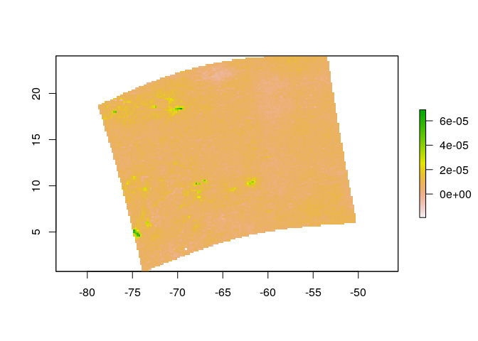

Análisis de datos atmosféricos
================

Instalar paquete S5Processor
----------------------------

``` r
#devtools::install_github("MBalthasar/S5Processor")
```

Cargar paquetes
---------------

``` r
library(S5Processor)
library(raster)
```

    ## Loading required package: sp

Cargar datos

``` r
f <- 'S5P_NRTI_L2__NO2____20191209T173610_20191209T174110_11170_01_010302_20191209T182308.nc'
nc <- ncdf4::nc_open(f)
vars <- attributes(nc$var)$names
p <- 6
p
```

    ## [1] 6

``` r
ncr <- S5P_process(input = f, product = p)
```

    ## [1] "Variables checked"
    ## [1] "Receiving product information"
    ## [1] "Getting values from file 1 of 1"
    ## [1] "Convert data frame to spatial points"
    ## [1] "Calculate number of rows and columns for raster file"
    ## [1] "Create raster file from points"
    ## [1] "====================== Done! ======================"
    ## [1] "Total processing time: 0.604771614074707 seconds"
    ## [1] "Tropospheric vertical column of nitrogen dioxide in the unit mol m-2"
    ## [1] "Multiplication factor to convert to molecules per cm2: 60221399743430918144"



``` r
ncr
```

    ## class      : RasterLayer 
    ## dimensions : 129, 154, 19866  (nrow, ncol, ncell)
    ## resolution : 0.1852291, 0.1808424  (x, y)
    ## extent     : -78.79269, -50.2674, 0.7322003, 24.06087  (xmin, xmax, ymin, ymax)
    ## crs        : +proj=longlat +datum=WGS84 +no_defs +ellps=WGS84 +towgs84=0,0,0 
    ## source     : memory
    ## names      : layer 
    ## values     : -1.928063e-05, 6.898683e-05  (min, max)

Exportar
--------

``` r
writeRaster(ncr, paste0(gsub('.nc', '', f), '_', gsub('/','_', vars[p]), '.tif'), overwrite=T)
```
